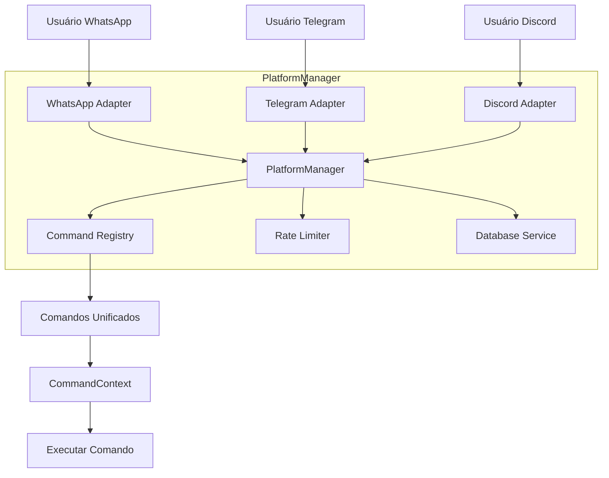

# Arquitetura do Bot-WPP

## Visão Geral

O Bot-WPP é um sistema distribuído projetado para operar como um bot multi-plataforma (WhatsApp, Telegram, Discord). A arquitetura está em transição entre dois sistemas:

### Sistema Atual (Legado)
- **Bot (Cliente WhatsApp Web)**: O coração do sistema, responsável por interagir diretamente com o WhatsApp. Ele processa mensagens, executa comandos e gerencia a comunicação com o serviço de Relay.
- **Relay (Serviço Intermediário)**: Um servidor Node.js que atua como um buffer e orquestrador. Ele gerencia a comunicação entre o Frontend e o Bot, armazena temporariamente dados de localização e pode hospedar lógica de comandos customizados.
- **Frontend (Interface Web)**: Uma interface web simples para a captura de coordenadas GPS, que envia dados para o Relay.

### Sistema Novo (Multi-Plataforma)
- **PlatformManager**: Orquestrador singleton que gerencia múltiplas plataformas (WhatsApp, Telegram, Discord)
- **PlatformAdapter**: Interface unificada para cada plataforma
- **CommandContext**: Contexto unificado para execução de comandos
- **Entry Point**: `src/core/multiPlatform.ts` (configurado no PM2)

### Estado Atual (CRÍTICO)
⚠️ **CONFLITO DE SISTEMAS**: O projeto tem dois sistemas em paralelo:
1. Sistema legado (`src/whatsapp.ts`) - sendo usado atualmente
2. Sistema multi-plataforma (`src/core/multiPlatform.ts`) - configurado no PM2 mas não está sendo usado corretamente

**Impacto**: Comandos não funcionam corretamente, verificações de plataforma falham, permissões de admin não são verificadas.

## Diagrama de Arquitetura

### Sistema Legado (Atual)
```mermaid
graph TD
    User[Usuário WhatsApp] -- Mensagem --> WhatsApp[Serviço WhatsApp]
    WhatsApp -- Evento de Mensagem --> Bot[Bot-WPP (Linux VPS)]

    subgraph Bot-WPP (Linux VPS)
        direction LR
        A[src/whatsapp.ts] -- Processa Eventos --> B{src/services/messageHandler.ts}
        B -- Não é Comando --> C[src/services/moderationService.ts]
        B -- Não é Comando --> D[src/services/keywordHandler.ts]
        B -- É Comando --> E[src/bot/commands/index.ts]
        E -- Executa --> F[Comandos Individuais (src/bot/commands/*)]
        E -- Comando não encontrado --> G[src/services/relayClient.ts]
    end

    subgraph Relay (Render.com)
        direction LR
        H[API REST] -- Recebe Localização --> I[Armazenamento Temporário (In-Memory)]
        J[API REST] -- Fornece Comandos Customizados --> K[Lógica de Comandos Customizados]
    end

    subgraph Frontend (Cloudflare Pages)
        direction LR
        L[Interface Web] -- Envia Localização --> H
    end

    G -- Busca Comandos Customizados --> J
    Bot -- Polling de Localização --> H
    I -- Envia Localização --> Bot
```

### Sistema Multi-Plataforma (Planejado)


## Componentes Detalhados

### 1. Bot (Linux VPS) - Sistema Legado

-   **Tecnologia**: Node.js, TypeScript, `whatsapp-web.js`.
-   **Funções**:
    -   Conexão e autenticação com o WhatsApp.
    -   Recebimento e processamento de mensagens.
    -   Execução de comandos internos.
    -   Polling do serviço de Relay para localizações pendentes.
    -   Moderação de conteúdo e filtragem de palavras-chave.
    -   Integração com a API Gemini para respostas inteligentes.
-   **Gerenciamento de Processos**: PM2 para garantir alta disponibilidade e reinício automático.
-   **Entry Point**: `src/whatsapp.ts` → `startBot()`
-   **Comandos**: Assinatura legada `(msg, client, args)`

### 2. PlatformManager (Sistema Novo)

-   **Tecnologia**: Node.js, TypeScript
-   **Funções**:
    -   Gerenciar múltiplas plataformas simultaneamente
    -   Normalizar IDs com prefixos (wpp:, tg:, dc:)
    -   Executar comandos de forma agnóstica
    -   Suportar broadcast entre plataformas
    -   Registry de comandos global
-   **Entry Point**: `src/core/multiPlatform.ts`
-   **Comandos**: Assinatura nova `(ctx: CommandContext)`
-   **Status**: Implementado mas não está sendo usado

### 3. Problemas de Integração

**Entry Point Conflitante:**
- `ecosystem.config.js` aponta para `dist/core/multiPlatform.js`
- `src/core/index.ts` chama `startBot()` do sistema legado
- Isso causa inconsistência no sistema ativo

**Comandos com Problemas:**
- `$ban`: Tem `platforms: ['whatsapp']` mas verificação falha
- `lista1edit`: Usa formato legado sem `CommandContext`
- Outros comandos podem ter problemas similares

**Solução Necessária:**
1. Unificar entry point para usar `multiPlatform.ts`
2. Migrar todos os comandos para `CommandContext`
3. Remover código legado desnecessário

### 2. Relay (Render.com)

-   **Tecnologia**: Node.js, Express.js.
-   **Funções**: 
    -   API REST para receber dados de localização do Frontend.
    -   API REST para fornecer localizações pendentes ao Bot.
    -   API REST para gerenciar e fornecer comandos customizados.
    -   Armazenamento temporário (in-memory) de localizações e metadados de clientes.
-   **Características**: Arquitetura `Pure JS` para evitar problemas de dependências nativas em ambientes de deploy como Render.

### 3. Frontend (Cloudflare Pages)

-   **Tecnologia**: HTML, CSS, JavaScript.
-   **Funções**: 
    -   Interface de usuário para solicitar e capturar a localização GPS do dispositivo.
    -   Envio seguro das coordenadas de localização para o serviço de Relay.

## Fluxo de Dados e Interações Chave

1.  **Inicialização do Bot**: O `src/whatsapp.ts` inicia o cliente `whatsapp-web.js`, realiza verificações de pré-voo (`preFlightCheck`) e configura os listeners de eventos.
2.  **Recebimento de Mensagens**: Qualquer mensagem recebida pelo WhatsApp é encaminhada para `src/services/messageHandler.ts`.
3.  **Processamento de Mensagens**: 
    -   O `messageHandler` primeiro verifica se a mensagem é um comando (começa com `$`).
    -   Se **não** for um comando, a mensagem passa por `src/services/moderationService.ts` (para spam, links, apostas) e `src/services/keywordHandler.ts` (para trollagem, palavras-chave como "bot"). Essas etapas podem resultar na exclusão da mensagem ou em uma resposta automática.
    -   Se **for** um comando, ele é processado diretamente. O `messageHandler` tenta encontrar o comando no mapa de comandos carregados (`src/bot/commands/index.ts`).
    -   Se o comando não for encontrado localmente, o `src/services/relayClient.ts` é acionado para buscar comandos customizados no serviço de Relay.
4.  **Sistema de Geolocalização**: 
    -   O Frontend captura a localização do usuário e a envia para o Relay via API.
    -   O Bot periodicamente faz polling no Relay para verificar se há localizações pendentes para os `chatIds` que as solicitaram.
    -   Ao receber uma localização do Relay, o Bot a formata e a envia de volta ao usuário no WhatsApp.

## Protocolo de Segurança

A comunicação entre os componentes é protegida por uma chave de autenticação (`WARRIOR_AUTH_KEY`) que deve ser configurada em todas as pontas (Frontend, Bot, Relay) para garantir que apenas serviços autorizados possam interagir. A chave é enviada no cabeçalho `x-api-key` nas requisições para o Relay.

## Considerações de Design

-   **Modularidade**: O código é organizado em módulos para facilitar a manutenção e a adição de novas funcionalidades.
-   **Escalabilidade**: A separação de responsabilidades entre Bot, Relay e Frontend permite que cada componente seja escalado independentemente.
-   **Resiliência**: O uso de PM2 para o Bot e a arquitetura `Pure JS` para o Relay visam aumentar a robustez do sistema em ambientes de produção.
-   **Segurança**: Implementação de chaves de API e moderação de conteúdo para proteger o sistema contra uso indevido e spam.
