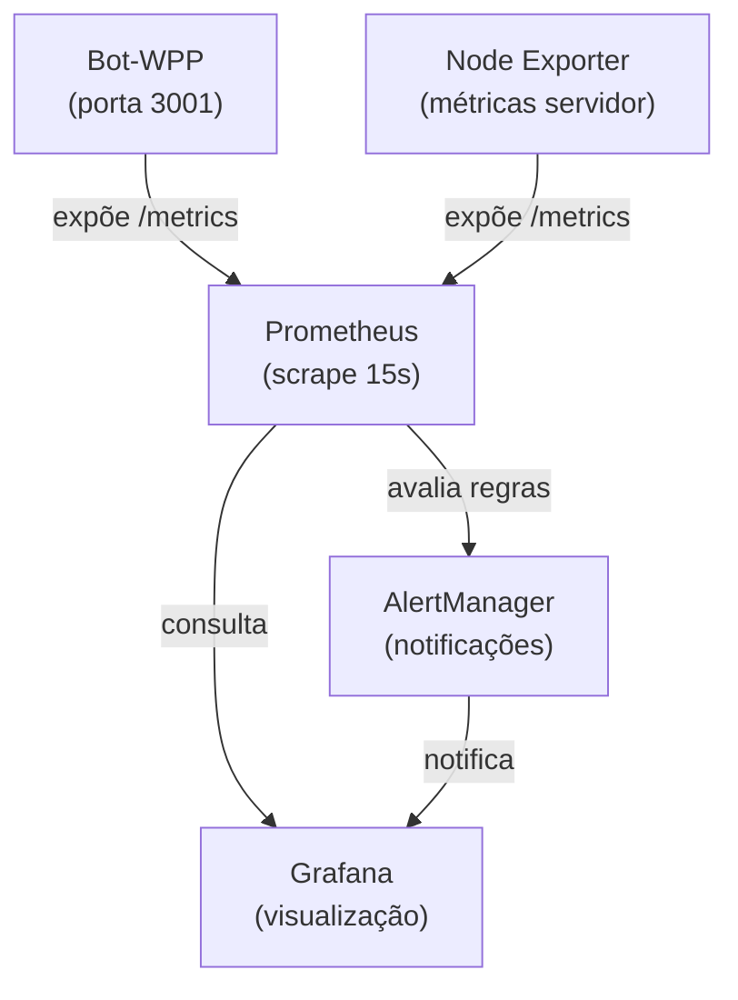

# 📊 Guia de Implementação: Prometheus + Grafana

## 🎯 Objetivo

Implementar monitoramento completo e observabilidade do Bot-WPP usando Prometheus (coleta de métricas) e Grafana (visualização e alertas).

## 🚀 Quick Start

### 1. Instalação de Dependências

`prom-client` já está instalado em `package.json`. Se necessário reinstalar:

```bash
npm install prom-client
```

### 2. Inicializar Prometheus + Grafana + AlertManager

```bash
# Iniciar todos os serviços
docker-compose up -d

# Verificar status
docker-compose ps
```

### 3. Acessar Interfaces

- **Prometheus**: http://localhost:9090
- **Grafana**: http://localhost:3100 (admin/admin)
- **AlertManager**: http://localhost:9093
- **Node Exporter**: http://localhost:9100
- **Métricas do Bot**: http://localhost:3001/metrics
- **Health Check**: http://localhost:3001/health

## 📈 Arquitetura de Monitoramento



## 🔧 Integração no Código

### 1. Inicializar MetricsService no Bot

```typescript
import metricsService from './src/services/metricsService';

// Na inicialização do bot
async function startBot() {
  // Iniciar servidor de métricas
  await metricsService.start();

  // Iniciar coleta automática de métricas de sistema (a cada 60s)
  metricsService.startSystemMetricsCollection(60000);

  // Resto da inicialização...
}
```

### 2. Registrar Eventos

```typescript
import metricsService from './services/metricsService';

// Ao receber mensagem
metricsService.recordMessageReceived('whatsapp');

// Ao enviar mensagem
metricsService.recordMessageSent('whatsapp');

// Ao executar comando (com sucesso)
metricsService.incrementCommand('help', 'whatsapp');

// Ao executar comando (com erro)
metricsService.recordCommandError('ban', 'timeout', 'whatsapp');

// Ao conectar plataforma
metricsService.recordPlatformConnection('whatsapp');

// Ao desconectar plataforma
metricsService.recordPlatformDisconnection('whatsapp');

// Ao atingir rate limit
metricsService.incrementRateLimitHit();

// Registrar duração de processamento
const start = Date.now();
// ... processar mensagem ...
const duration = Date.now() - start;
metricsService.recordMessageProcessingDuration('whatsapp', duration);
```

## 📊 Métricas Disponíveis

### Contadores (acumulativos)

- `bot_messages_received_total{platform}`: Total de mensagens recebidas
- `bot_messages_sent_total{platform}`: Total de mensagens enviadas
- `bot_commands_executed_total{command,platform}`: Comandos executados com sucesso
- `bot_commands_errored_total{command,error_type,platform}`: Comandos com erro
- `bot_platform_connections_total{platform}`: Conexões de plataforma
- `bot_platform_disconnections_total{platform}`: Desconexões de plataforma
- `bot_telegram_messages_total{direction}`: Mensagens Telegram (sent/received)
- `bot_discord_messages_total{direction}`: Mensagens Discord (sent/received)
- `bot_whatsapp_messages_total{direction}`: Mensagens WhatsApp (sent/received)
- `bot_rate_limit_hits_total`: Atingimentos de rate limit

### Medidores (valores instantâneos)

- `bot_active_connections{platform}`: Conexões ativas por plataforma
- `bot_active_platforms`: Número de plataformas ativas
- `bot_queue_size`: Tamanho da fila de mensagens
- `bot_memory_usage_bytes`: Uso de memória em bytes
- `bot_uptime_seconds`: Uptime em segundos
- `bot_last_heartbeat_timestamp`: Timestamp do último heartbeat
- `bot_error_rate{platform}`: Taxa de erro (0-1)

### Histogramas (distribuições)

- `bot_message_processing_duration_ms{platform}`: Duração do processamento
- `bot_command_execution_duration_ms{command}`: Duração da execução de comando
- `bot_relay_response_time_ms`: Tempo de resposta do relay

## 🚨 Alertas Configurados

| Alerta | Severidade | Descrição |
|--------|-----------|-----------|
| BotDown | CRÍTICO | Bot offline por >2 min |
| HighErrorRate | CRÍTICO | Taxa erro >10% por 5 min |
| HighMemoryUsage | AVISO | Uso memória >500MB por 5 min |
| AllPlatformsDisconnected | CRÍTICO | Sem plataformas ativas |
| PlatformDisconnected | AVISO | Plataforma desconectada >2 min |
| SlowMessageProcessing | AVISO | P95 processamento >1s |
| SlowCommandExecution | AVISO | P95 execução comando >2s |
| RelayResponseSlow | AVISO | P95 relay >500ms |
| LargeQueueBacklog | AVISO | Fila >100 mensagens |
| HighRateLimitHits | AVISO | Rate limit >1/s |
| NoHeartbeat | CRÍTICO | Sem heartbeat >5 min |

## 📱 Dashboards Grafana

### Painel Principal: Bot-WPP Overview

1. **Taxa de Mensagens**: Mensagens recebidas/enviadas por segundo
2. **Conexões Ativas**: Número de conexões por plataforma
3. **Duração de Processamento**: P95 e P99 de latência
4. **Comandos Executados**: Comandos com sucesso (1h)
5. **Erros de Comando**: Comandos com falha (1h)
6. **Uso de Memória**: Consumo atual em MB
7. **Uptime**: Tempo de atividade em horas

## 🔍 Queries Úteis (PromQL)

```promql
# Taxa de mensagens por plataforma (últimos 5 min)
rate(bot_messages_received_total[5m])

# Percentil 95 de latência de processamento
histogram_quantile(0.95, rate(bot_message_processing_duration_ms_bucket[5m]))

# Taxa de erro
(increase(bot_commands_errored_total[5m]) / 
 (increase(bot_commands_executed_total[5m]) + 
  increase(bot_commands_errored_total[5m])))

# Memória em MB
bot_memory_usage_bytes / 1024 / 1024

# Plataformas desconectadas
bot_active_connections == 0

# Fila crescendo
rate(bot_queue_size[5m]) > 0
```

## 🛠️ Troubleshooting

### Prometheus não vê métricas do Bot

```bash
# Verificar conectividade
curl http://localhost:3001/metrics

# Verificar logs do Prometheus
docker logs bot-prometheus
```

### Grafana não conecta ao Prometheus

- Acesse Grafana (http://localhost:3100)
- Configuration → Data Sources
- Editar "Prometheus" datasource
- URL deve ser `http://prometheus:9090`

### AlertManager não notifica

- Editar `alertmanager.yml` com configuração de notificação
- Exemplos: Slack, PagerDuty, Email
- Recarregar: `docker restart bot-alertmanager`

## 📋 Deployment em Produção (Linux)

### 1. Copiar arquivos para servidor

```bash
scp docker-compose.yml solanojr@100.101.218.16:/home/solanojr/bot-wpp/
scp prometheus.yml solanojr@100.101.218.16:/home/solanojr/bot-wpp/
scp alertmanager.yml solanojr@100.101.218.16:/home/solanojr/bot-wpp/
scp -r grafana/ solanojr@100.101.218.16:/home/solanojr/bot-wpp/
```

### 2. Iniciar no servidor

```bash
ssh solanojr@100.101.218.16
cd /home/solanojr/bot-wpp
docker-compose up -d

# Verificar
docker-compose ps
docker logs bot-prometheus
```

### 3. Acessar remotamente

- **Prometheus**: http://100.101.218.16:9090
- **Grafana**: http://100.101.218.16:3100
- **Métricas**: http://100.101.218.16:3001/metrics

## 🧹 Limpeza

```bash
# Parar serviços
docker-compose down

# Remover volumes (cuidado!)
docker-compose down -v

# Limpar dados Prometheus
docker volume rm bot-wpp_prometheus_data

# Limpar dados Grafana
docker volume rm bot-wpp_grafana_data
```

## 📚 Referências

- [Prometheus Documentation](https://prometheus.io/docs)
- [Grafana Documentation](https://grafana.com/docs)
- [prom-client Node.js](https://github.com/siimon/prom-client)
- [AlertManager Configuration](https://prometheus.io/docs/alerting/latest/configuration/)

## ✅ Checklist de Implementação

- [ ] `prom-client` instalado
- [ ] `metricsService.ts` criado e integrado
- [ ] `docker-compose.yml` atualizado com Prometheus/Grafana/AlertManager
- [ ] `prometheus.yml` configurado
- [ ] `alertmanager.yml` configurado
- [ ] Grafana datasource conectado
- [ ] Dashboard Bot-WPP importado
- [ ] Alertas testados
- [ ] Métricas aparecendo em Prometheus
- [ ] Logs verificados (não há erros)
- [ ] Documentação atualizada em `PROJECT_MEMORY.md`
